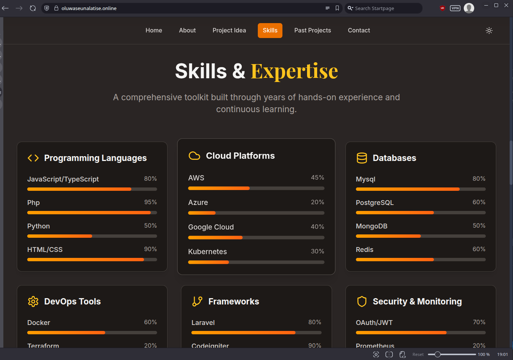
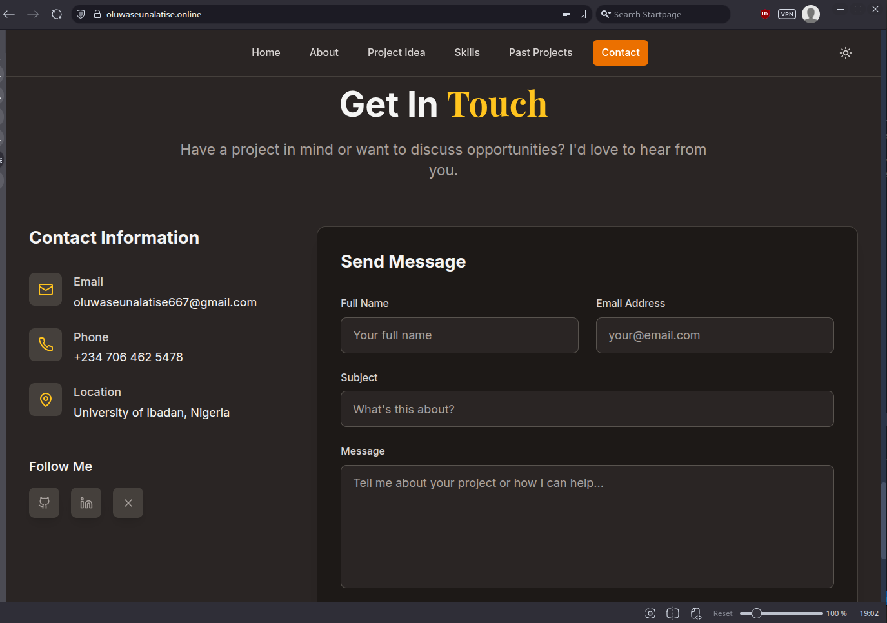

# AWS Account Setup & Prototype Deployment Documentation

This document outlines the detailed process used to create and configure an AWS account for deploying a professional-grade dynamic prototype web application, suitable for technical showcases to potential investors.

## Table of Contents

- [1. Project Context](#1-project-context)
- [2. AWS Account Creation](#2-aws-account-creation)
- [3. IAM User and Group Setup](#3-iam-user-and-group-setup)
- [4. Setting Up Billing Alerts and Budgets](#4-setting-up-billing-alerts-and-budgets)
- [5. Provisioning an AWS EC2 Server](#5-provisioning-an-aws-ec2-server)
- [6. Configure Apache Virtual Host for Your Domain](#configure-apache-virtual-host-for-your-domain)
- [7. Secure Your Server with Let’s Encrypt SSL (Certbot)](#secure-your-server-with-lets-encrypt-ssl-certbot)
- [Connect Domain (Namecheap) to AWS EC2](#connect-domain-namecheap-to-aws-ec2)
- [Caution: Common HTTPS Setup Issues](#caution-common-https-setup-issues)
- [Additional: Testing the Apache2 Web Server (Optional)](#additional-testing-the-apache2-web-server-optional)
- [Upload a Custom HTML File to Apache](#upload-a-custom-html-file-to-apache)
- [Screenshots](#screenshots)


---

## 1. Project Context

Your startup team needs to create a dynamic prototype of a web application to showcase your technical skills to investors. Unlike a basic landing page, you’ll enhance it with optional interactive features while ensuring it’s professionally deployed.

---

## 2. AWS Account Creation

- **Date Created:** 12/06/2025
- **Registered Email:** holynation667@gmail.com
- **MFA Enabled on Root Account:** Yes
- **Public IP Adddress / Custom Domain:** 34.224.221.167 / https://oluwaseunalatise.online
- **Github Link:** https://github.com/holynation/portfolio.git
- **Deployment Script:** 

### MFA Setup for Root User

To enhance account security, Multi-Factor Authentication (MFA) was enabled on the root user. This was done via the following steps:

1. Logged into the AWS Management Console.
2. Searched for **IAM** using the search bar at the top of the screen.
3. Navigated to the **IAM dashboard** and located the option to enable MFA for the root user.
4. Clicked the prompt to set up MFA, entered a device name, and selected **Google Authenticator** as the MFA type. *(Note: The app was installed from the Play Store beforehand.)*
5. Scanned the provided QR code using the Google Authenticator app to link it.
6. Entered two consecutive time-based codes (30 seconds apart) from the app.
7. Successfully enabled MFA for the root user.

This ensures the root account is secured with an extra layer of authentication beyond the password.

[🔝 Back to Top](#table-of-contents)

## 3. IAM User and Group Setup

### Creating IAM User – `itadmin`

1. While still in the **IAM Dashboard**, clicked on **Users** from the left sidebar to view all existing users.
2. Clicked on **Create user** at the top right corner.
3. Provided a username: `itadmin`.
4. Enabled access to the AWS Management Console by checking: 
   **"Provide user access to the AWS Management Console – optional"**.
5. Selected **"I want to create an IAM user"** as the console access option.
6. For the password settings, left the default **Autogenerated password** option.
7. Ensured the box labeled **"Users must create a new password at next sign-in – Recommended"** was checked.
8. Clicked **Next** to proceed to permissions.

### Assigning Permissions

9. Chose the **Attach policies directly** option to assign permissions manually.
10. From the list of AWS managed policies, selected only **AdministratorAccess**.
11. Proceeded to the **Review** step, confirmed the details, and clicked **Create user**.

After the user was created:
- A success screen appeared showing login instructions for the new IAM user.
- Downloaded the `.csv` file containing the login credentials (username, password, and console login URL).

### Enabling MFA for IAM User

12. Returned to the **Users** list and selected the `itadmin` user.
13. Navigated to the **Security credentials** tab.
14. Under **Multi-factor authentication (MFA)**, initiated the MFA setup for this IAM user.
15. Followed the same procedure used for the root user:
    - Chose **Google Authenticator**
    - Scanned the QR code in the app
    - Entered two time-based codes from the app to complete setup

> Additional Note: The IAM interface provides options to explore Groups, Tags, and Permissions. These can be used to refine access, organize users, and manage permissions according to best practices like **least privilege**.

[🔝 Back to Top](#table-of-contents)


## 4. Setting Up Billing Alerts and Budgets

To prevent unexpected charges and stay within your AWS budget, it's essential to set up billing alerts using **CloudWatch**. These alerts notify you via email when you exceed a specified spending threshold or start using a service that may incur unexpected costs.

#### Steps to Set Up Billing Alerts:

1. **Access Billing Dashboard:**
   - Click on your account dropdown (top-right corner of the AWS console).
   - Select **Billing and Cost Management**.
   - This brings up your billing dashboard showing historical billing data.

2. **Understand Current Billing:**
   - On the left sidebar, select **Bills**.
   - This section shows you which services are incurring charges, helping identify services to clean up.

3. **Configure Billing Preferences:**
   - On the same left sidebar, click **Billing Preferences**.
   - Enable the following:
     - **Receive PDF invoices by email**
     - **Receive AWS Free Tier Usage Alerts** (e.g., at 85% usage)
     - **Receive CloudWatch Billing Alerts**

4. **Navigate to CloudWatch and Confirm Region:**
   - Go back to the main AWS console dashboard.
   - Use the **search bar** to search for and open **CloudWatch**.
   - Once inside the CloudWatch dashboard, check the **top-right corner** to confirm the region is set to **N. Virginia (us-east-1)** — this is the required region for billing metrics to appear.
   - If it’s not selected, switch to N. Virginia before proceeding.

5. **Create a Billing Alarm in CloudWatch:**
   - In CloudWatch, from the left sidebar, go to **Alarms > All Alarms**.
   - Click **Create Alarm**.

6. **Select Billing Metric:**
   - Under metrics, choose **Billing**.
   - If not visible, ensure you've enabled billing alerts in your preferences and are in the N. Virginia region.
   - Choose **Total Estimated Charge**.
   - Set the currency to **USD** and click **Create Metric**.

7. **Set Threshold Conditions:**
   - Define a spending limit (e.g., **5 USD**).
   - This sets the alarm to trigger when the estimated charges exceed $5.

8. **Configure Notifications:**
   - Under **Notification Actions**, stick with the default "In alarm" state.
   - Choose or create an **SNS Topic**:
     - The topic name can be **any name of your choice** (e.g., `AltSchool_MonitoringTeam`).
     - Add your **email address** to receive alerts.

9. **Confirm Email Subscription and Finalize Alarm:**
   - Check your email inbox for a **confirmation email from AWS SNS**.
   - Click the confirmation link to **confirm your subscription**.
   - After confirming, go back to the **CloudWatch alarm page** and **refresh** it.
   - Ensure the **alarm state is "OK"** and **"Actions enabled"** is displayed.

   ✅ This confirms that your billing alarm is now active and properly configured.
   

[🔝 Back to Top](#table-of-contents)

## 5. Provisioning an AWS EC2 Server

To provision an EC2 server on AWS, follow these steps:

#### Step 1: Log in Using the IAM User
- Sign in to the AWS Console using the IAM user created earlier.
- Use the downloaded `.csv` file for login credentials, or retrieve credentials by checking **IAM > Users > Security Credentials**.

#### Step 2: Access EC2 Service
- In the AWS Console search bar, type `EC2` and select **EC2 (Elastic Compute Cloud)**.

#### Step 3: Create a Key Pair
- In the left sidebar, click **Key Pairs** under **Network & Security**.
- Click **Create Key Pair**.
- Use a naming convention like: 
  `projectname-environment-regionname`
  _Example_: `altschool-prod-us-east-1`
- Choose **RSA** as the key pair type.
- This will download a `.pem` file to your default Downloads folder.

#### Step 4: Create a Security Group
- In the EC2 sidebar, click **Security Groups** under **Network & Security**.
- Click **Create Security Group**.
- Use a naming convention like:
  `projectname-servicename-environment-sg`
  _Example_: `altschool-web-prod-sg`
- Add **Inbound Rule**:
  - Type: `SSH`
  - Source: Your current IP address _(static or dynamic)_.
  - **Why?** Only your machine should be able to SSH into the server.
- Leave **Outbound Rule** as default:
  - Type: `All traffic`
  - Destination: `Anywhere`
  _(This allows server access to the internet)_

#### Step 5: Launch an EC2 Instance
- Click **Instances** in the EC2 sidebar, then **Launch Instance**.
- Configure the following:
  - **Name**: e.g. `altschool-web-server`
  - **Amazon Machine Image (AMI)**: Choose **Ubuntu (Free tier eligible)**.
  - **Instance Type**: Use default (`t2.micro` for free tier).
  - **Key Pair**: Select the one created earlier.
  - **Network Settings**:
    - Under **Firewall (Security Groups)**, choose the existing security group created earlier.
- Leave other settings as default.
- Click **Launch Instance**.

#### Step 6: Access the EC2 Instance via SSH
- Click on the created instance name to view instance details.
- Copy the **Public IPv4 address**.
- Use the following SSH command:
  ```bash
  ssh -i path/to/downloaded-key.pem ubuntu@<public-ip-address>

- Example:

  ```bash
  ssh -i Downloads/altschool.pem ubuntu@34.224.xxx.xxx

Accept the prompt to continue. You’re now inside your EC2 instance.

#### Step 7: Install Web Server (Apache or Nginx)

Our choice will be Apache: Run the following commands:

1. Update package lists and install Apache:
   ```bash
   sudo apt update && sudo apt install apache2 -y
   ```

2. Verify Apache is running:
   ```bash
   sudo systemctl status apache2
   ```
   - You should see `active (running)` in the output
   - If not running, start it with:
     ```bash
     sudo systemctl start apache2
     ```

#### Step 8: Deploy a Static HTML Page

1. Create or upload your HTML file to the server

2. Copy the file to the web directory:
   ```bash
   sudo cp ~/index.html /var/www/html/
   ```
   - Replace `index.html` with your actual filename

3. Set proper permissions:
   ```bash
   sudo chown www-data:www-data /var/www/html/index.html
   sudo chmod 644 /var/www/html/index.html
   ```

4. Access your webpage:
   - Open a browser and visit:
     ```
     http://<your-ec2-public-ip>
     ```
   - You should see your HTML content displayed
   - Note: You might not necessarily see your content based on the security group rules that was set on the previously on the server. So read the section below [**Testing the Apache2 Web Server**], to show you how to update your security groups rules to allow public access to your public IP address.

5. (Optional) Test changes without caching:
   ```bash
   curl http://localhost
   ```

Got it! Here's your updated **Section 4: Testing the Apache2 Web Server** in proper **Markdown format** with your latest instructions included:


[🔝 Back to Top](#table-of-contents)


## 6. Configure Apache Virtual Host for Your Domain

> **Why?** Ensures Certbot can issue SSL certificates specifically for your domain (not just server IP)

### 1. Create Site Directory
```bash
sudo mkdir -p /var/www/example.com/html
```

### 2. Set Permissions
```bash
sudo chown -R $USER:$USER /var/www/example.com/html
```

### 3. Add HTML Content
```bash
nano /var/www/example.com/html/index.html
```
Sample content:
```html
<!DOCTYPE html>
<html>
<head>
    <title>Welcome to Example.com</title>
</head>
<body>
    <h1>Success! Your site is working</h1>
</body>
</html>
```

### 4. Create Virtual Host Config
```bash
sudo nano /etc/apache2/sites-available/example.com.conf
```
Copy the below and paste into your config created:
```apache
<VirtualHost *:80>
    ServerAdmin admin@example.com
    ServerName example.com
    ServerAlias www.example.com
    DocumentRoot /var/www/example.com/html
    
    ErrorLog ${APACHE_LOG_DIR}/error.log
    CustomLog ${APACHE_LOG_DIR}/access.log combined
</VirtualHost>
```
Replace `example.com` with your actual domain name.

### 5. Enable Configuration
```bash
sudo a2ensite example.com.conf
sudo a2dissite 000-default.conf  # Disable default site
```

### 6. Reload Apache
```bash
sudo systemctl reload apache2
```

### 7. Verify DNS Configuration
- Ensure Namecheap A records point to your EC2 public IPv4
- Check with:
  ```bash
  ping example.com
  ```

### Final Test
Visit in browser:
```
http://example.com
```

> ⏳ DNS changes may take 5min-24hrs to propagate fully

[🔝 Back to Top](#table-of-contents)


## 7. Secure Your Server with Let’s Encrypt SSL (Certbot)

> 🔒 **Goal**: Enable HTTPS using free SSL certificates from [Let's Encrypt](https://letsencrypt.org/)

### Prerequisites
- Domain pointing to EC2 IP (e.g., `example.com`). [Click here to point your domain](#connect-domain-namecheap-to-aws-ec2)
- Your **security group** has port **443 (HTTPS)** and **80 (HTTP)** open (inbound rules).

### Installation:

#### 1. Install Snapd
```bash
sudo apt update && sudo apt install snapd -y
```

#### 2. Update Snap Core
```bash
sudo snap install core && sudo snap refresh core
```

#### 3. Remove Old Certbot
```bash
sudo apt remove certbot -y
```

#### 4. Install Certbot
```bash
sudo snap install --classic certbot
```

#### 5. Create Symlink
```bash
sudo ln -s /snap/bin/certbot /usr/bin/certbot
```


### Request SSL Certificate:
```bash
sudo certbot --apache -d yourdomain.com -d www.yourdomain.com
```
Certbot will:
- Detect Apache config
- Ask for your email address (for renewal notices)
-  Ask if you agree to the terms
- Verify domain ownership and Install certificates
-   Ask if you want to redirect HTTP to HTTPS (choose **yes** for redirection)
- Reload Apache


### Test Renewal (Optional):
```bash
sudo certbot renew --dry-run
```
Note: Certificates auto-renew every 90 days. Certbot installs a cron job automatically (or a systemd timer) to auto-renew your certificate. You don’t need to worry about it expiring.

### Optional: Check the SSL with a Tool

Use [ssllabs](https://www.ssllabs.com/ssltest/) to test your domain for SSL score and cert info.


### Verification:
Visit:  
`https://yourdomain.com`  
Should show secure lock icon (🔒)

---

### Bonus: Force HTTPS Redirect:
Add this to your Apache config:
```apache
<VirtualHost *:80>
    ServerName yourdomain.com
    Redirect permanent / https://yourdomain.com/
</VirtualHost>
```

## Connect Domain (Namecheap) to AWS EC2

> **Goal**: Point your domain to your EC2 server for web access (HTTP/HTTPS).

### Step 1: Get Your EC2 Public IP
1. Go to **AWS Console** → **EC2 Dashboard**
2. Select your instance
3. Copy the **Public IPv4 address**  
   (Example: `18.202.150.123`)

### Step 2: Access Your Domain Registrar (Namecheap) DNS Settings
1. Login to [Namecheap](https://namecheap.com)
2. Go to **Domain List** → Click **Manage** on your domain
3. Navigate to **Advanced DNS** tab

### Step 3: Configure DNS Records
Under **Host Records**, add/modify:

| Type | Host | Value            | TTL       |
|------|------|------------------|-----------|
| A    | @    | `your.ec2.ip`    | Automatic |
| A    | www  | `your.ec2.ip`    | Automatic |

> Replace `your.ec2.ip` with your actual EC2 IP  
> `@` = root domain (example.com), `www` = www.example.com

### Step 4: Verify DNS Propagation
1. Wait 5-30 minutes for changes to take effect
2. Test with:
   ```bash
   ping yourdomain.com
   ```


[🔝 Back to Top](#table-of-contents)


## Caution: Common HTTPS Setup Issues

#### "My Site Won't Load Over HTTPS!"

Don't panic! Here are the most common fixes you can try one after the other:

#### Quick Checklist
1. **Security Group Configuration**  
   Verify port 443 (HTTPS) is open in EC2 Security Groups  
   ```bash
   nc -zv yourdomain.com 443  # Should say "succeeded"
   ```

	If it says otherwise or something went wrong, it probably mean your HTTPS is not properly configured, do the following to configure HTTPS

	#### Configuration Steps:

	1. **Navigate to Security Groups**:
	   - AWS Console → EC2 Dashboard → Security Groups

	2. **Edit Inbound Rules**:
	   - Select your instance's security group
	   - Go to **Inbound rules** tab → **Edit inbound rules**

	3. **Add HTTPS Rule**:
    
	    -   **Type:** HTTPS
        
	    -   **Protocol:** TCP
        
	    -   **Port Range:** 443
        
	    -   **Source:** Anywhere (0.0.0.0/0, ::/0) — or restrict as needed.
        
	4. Click **Save rules**.


2. **Virtual Host Activation**
	```bash
	sudo a2ensite yourdomain.com.conf
	sudo systemctl reload apache2
	```

3. **File Path Verification**
	```bash
	ls -la /var/www/yourdomain.com/html/
	# Should show index.html with correct permissions
	```

4. **SSL Certificate Check**
	```bash
	sudo ls /etc/letsencrypt/live/yourdomain.com/
	# Should show cert.pem, privkey.pem, etc.
	```

5. **Permission Settings**
	```bash
	sudo chown -R $USER:$USER /var/www/yourdomain.com/
	sudo chmod -R 755 /var/www/yourdomain.com/
	```

6. **Port Configuration**
	```bash
	sudo apache2ctl -S  # Verify VirtualHost loading
	sudo ss -tulnp | grep ':443'  # Check 443 listening
	```

7. **Apache Syntax Check**
	```bash
	sudo apachectl configtest
	# Must return "Syntax OK"
	```

---

### Test Configuration:

Try this minimal working config:

```apache
<VirtualHost *:80>
    ServerName oluwaseunalatise.online
    DocumentRoot /var/www/html
    
    <Directory /var/www/html>
        Options -Indexes +FollowSymLinks
        AllowOverride All
        Require all granted
    </Directory>
</VirtualHost>
```

Then restart Apache:
```bash
sudo systemctl restart apache2
```

---

### Log Analysis:
```bash
sudo tail -30 /var/log/apache2/{error,access}.log
```

---

### Still Not Working?
1. Try accessing via IP first: `http://<your-ec2-ip>`
2. Check DNS propagation: `dig +short oluwaseunalatise.online`
3. Verify Certbot installation: `sudo certbot certificates`

[🔝 Back to Top](#table-of-contents)


## Additional: Testing the Apache2 Web Server (Optional)

After installing and starting the Apache2 service, it's important to verify whether it is serving content correctly.

### Confirm Apache2 Status

Check the status of the Apache2 service to ensure it's running:

```bash
sudo systemctl status apache2
```

Look for something like `active (running)` in green text.

----------

### Get Your Public IP

To access your server from a browser, you need the public IP address of your EC2 instance. Run the command:

```bash
curl http://checkip.amazonaws.com
```

Alternatively, get it from your EC2 instance **Description** tab in the AWS Console (look for **IPv4 Public IP**).

----------

### Page Not Loading? Here's Why

If you try accessing your server's IP in the browser right now (e.g., `http://<your-public-ip>`), **you'll notice that nothing loads**.

> **That's because of the Security Groups we set up earlier.**

#### Update Your Security Group to Allow HTTP:

Go back to your EC2 instance’s **Security Groups**:

1.  Click on the Security Group attached to your EC2 instance.
    
2.  Select the **Inbound rules** tab.
    
3.  Click **Edit inbound rules**.
    
4.  Add the following rules:

1. In EC2 Dashboard:
   - Select your instance
   - Click the Security Group link
2. Under **Inbound rules** tab:
   - Click **Edit inbound rules**
3. Add these rules:

| Type  | Protocol | Port Range | Source    | Description       |
|-------|----------|------------|-----------|-------------------|
| HTTP  | TCP      | 80         | 0.0.0.0/0 | Allow web traffic |
| HTTPS | TCP      | 443        | 0.0.0.0/0 | Optional SSL      |

4. Click **Save rules**


#### Test Again in Browser:

Now go back to your browser and refresh `http://<your-public-ip>`.

You should see either:

-   The **default Apache2 page**, or
    
-   If you uploaded an HTML file to `/var/www/html/`, you’ll see that file instead.
    

[🔝 Back to Top](#table-of-contents)

## Upload a Custom HTML File to Apache

Here's how to upload your own HTML file to the Apache2 web root:

### Step 1: Create or upload your HTML file

**Option 1:** Create directly on the server:
```bash
echo "<h1>Hello from My Apache Server!</h1>" | sudo tee /var/www/html/index.html
```

**Option 2:** Upload from your local computer:
```bash
scp -i /path/to/your-key.pem /path/to/local/index.html ubuntu@<your-public-ip>:/tmp
```

Then move it to the web root:
```bash
sudo mv /tmp/index.html /var/www/html/index.html
```

### Step 2: Set permissions (if necessary)
```bash
sudo chown -R your-username:www-data /var/www/html
sudo chmod -R 775 /var/www/html
```

### To know your username, run this on the server
```bash
whoami
```

### ✅ Final Test
Visit `http://<your-public-ip>` in your browser - you should now see your custom page rendered.

**Hurray!** You're now serving your own HTML content from an EC2 instance using Apache2!

[🔝 Back to Top](#table-of-contents)


## Screenshots







---

© 2025 Oluwaseun Alatise. All rights reserved.
Crafted with ❤️ for learning and deployment on AWS.

[🔝 Back to Top](#table-of-contents)


